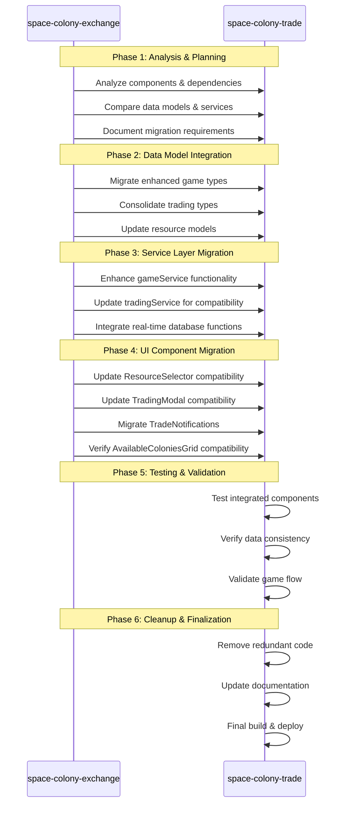

# Space Colony Trade - Migration Sequence Diagram

## Migration Process Overview

This document outlines the sequence of steps required to migrate and consolidate trading components from space-colony-exchange into the main space-colony-trade application.

## Detailed Migration Sequence Steps

### Phase 1: Analysis & Planning
1. **Compare Component Architecture**
   - Review both codebases to identify all trading-related components
   - Document component dependencies and interactions
   
2. **Analyze Data Flow**
   - Trace data flow through both applications
   - Identify integration points and potential conflicts

3. **Create Migration Plan**
   - Prioritize components for migration
   - Identify potential risks and mitigation strategies

### Phase 2: Data Model Integration
1. **Type Definitions**
   - Consolidate `game.ts` type definitions
   - Ensure `trading.ts` types are compatible with enhanced models
   - Update any references to type definitions

2. **Resource Model Updates**
   - Ensure consistent resource representation across components
   - Update any dependent validation logic

### Phase 3: Service Layer Migration
1. **gameService.ts Enhancements**
   - Add event creation functionality
   - Migrate round processing logic
   - Enhance session management functions

2. **tradingService.ts Updates**
   - Update trade validation for enhanced models
   - Ensure compatibility with real-time features
   - Add any missing trading functionality

3. **Real-time Database Integration**
   - Implement real-time subscriptions for trading activity
   - Ensure proper synchronization between Firestore and RTDB

### Phase 4: UI Component Migration
1. **ResourceSelector Updates**
   - Verify compatibility with enhanced resource models
   - Update validation logic if needed

2. **TradingModal Compatibility**
   - Ensure proper integration with updated services
   - Verify multi-step trade process works with enhanced models

3. **TradeNotifications Migration**
   - Migrate notification component with HUD-style UI
   - Ensure real-time updates are working

4. **AvailableColoniesGrid Verification**
   - Verify grid works with enhanced team models
   - Update partner selection logic if needed

### Phase 5: Testing & Validation
1. **Component Testing**
   - Test each migrated component individually
   - Verify proper rendering with test data

2. **Integration Testing**
   - Test complete trade flow from partner selection to completion
   - Verify real-time updates across components

3. **Game Flow Validation**
   - Test trades in context of game rounds and phases
   - Verify proper resource accounting and history

### Phase 6: Cleanup & Finalization
1. **Code Cleanup**
   - Remove redundant components from the codebase
   - Ensure consistent naming conventions
   - Remove any debug/development code

2. **Documentation Updates**
   - Update component documentation
   - Document any new procedures for developers

3. **Final Deployment**
   - Build production version
   - Deploy to Firebase Hosting
   - Verify live functionality
